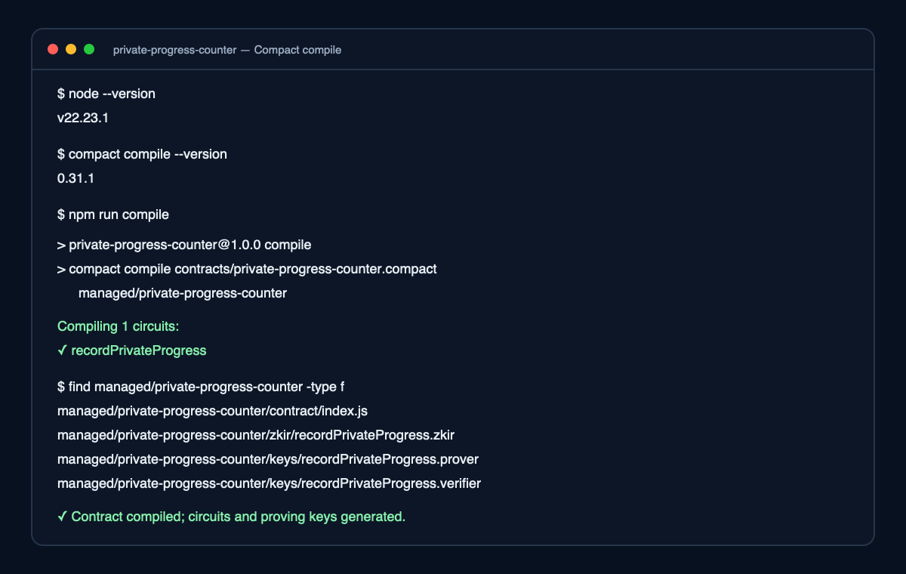
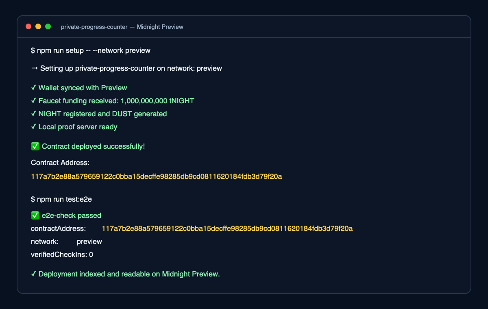

# VeilMark

> Build consistency. Keep the reason private.

VeilMark is a privacy-first daily progress ritual built on Midnight. A user connects Lace, creates one zero-knowledge check-in for the current UTC day, and publishes only a period-scoped commitment and the aggregate proof count. The private device key—and the personal context behind the check-in—never appears in the UI or on-chain.

## Live Deployment

| Item | Value |
| --- | --- |
| Live app | [rudrabhaskar9439.github.io/private-progress-counter](https://rudrabhaskar9439.github.io/private-progress-counter/) |
| Network | Midnight Preprod |
| Preprod contract | `9afd75682f9ebf51efabb743bd58d95352f8380ae4fb71aa06dfd4644de88fdc` |
| Verified proof transaction | `00d38f121f7f6feaad0b52136fb9f0bf49604431549ff9dd1b9eac6282a565675c` (block `1662053`) |
| Demo video | [42-second interface, circuit, and privacy walkthrough](https://rudrabhaskar9439.github.io/private-progress-counter/veilmark-demo.mp4) |
| Repository | [RudraBhaskar9439/private-progress-counter](https://github.com/RudraBhaskar9439/private-progress-counter) |

Earlier Level 1 evidence is preserved on Preview at `117a7b2e88a579659122c0bba15decffe98285db9cd0811620184fdb3d79f20a`.

## Why VeilMark Is Useful

Most habit trackers make the activity itself part of the product data. VeilMark separates accountability from disclosure: a learner, founder, caregiver, athlete, or wellness user can prove they showed up without publishing the sensitive reason behind that progress.

The current prototype proves a narrow, understandable claim:

> A device holding a private key created no more than one valid progress commitment for this UTC day.

This is intentionally more useful than a generic counter. The same primitive can become a private streak layer for cohorts, grants, learning programs, recovery communities, or personal goals.

## Privacy Claim

### Stays private

- A random 32-byte device key generated with `crypto.getRandomValues()`.
- The user's real-world activity, reason, goal, and notes.
- The witness value supplied to the Compact circuit.

### Becomes public

- The aggregate `verifiedCheckIns` count.
- The latest UTC period tag, such as `2026-07-15`.
- A domain-separated one-way commitment derived from the device key and period.

### What the proof guarantees

`recordPrivateProgress(period)` obtains the key through the `localSecret()` witness, hashes `["veilmark:daily:v1", secret, period]`, rejects a commitment already present in `usedCommitments`, then updates the public ledger. The `disclose()` operation applies only to the derived commitment—not to the secret.

Because the period is included in the commitment, the same device produces a different public value on a different day. Because the contract stores used commitments, that device cannot submit the same day's proof twice.

## User Flow

1. Open the live app with Lace installed and configured for Midnight Preprod.
2. Select a compatible wallet if more than one connector is available.
3. Connect and approve access in Lace.
4. Click **Prove today's progress**.
5. VeilMark creates the witness locally, generates the zero-knowledge proof, and asks Lace to approve the transaction.
6. The app confirms **“Proved without revealing your input.”** and displays only the transaction identifier and public state.
7. Disconnecting clears the app session while leaving the device key in local browser storage for tomorrow's proof.

The interface includes detection, missing-wallet guidance, connector-version checks, network mismatch handling, connection cancellation handling, proof loading states, fee errors, duplicate-day feedback, and connect/disconnect controls.

## Architecture

```text
Lace wallet
    │ connect("preprod") / balance / submit
    ▼
React + Vite frontend
    │ local witness + period tag
    ▼
Midnight.js providers
    ├── browser ZK assets
    ├── Lace-configured proof server
    └── Preprod indexer
    ▼
Compact contract
    ├── recordPrivateProgress(period)
    ├── usedCommitments
    ├── latestCommitment
    ├── latestPeriod
    └── verifiedCheckIns
```

The frontend uses the current DApp Connector API, validates Connector API 4.x, checks the returned network configuration, and bridges Lace's serialized transactions into Midnight.js. ZK proving keys and ZKIR assets are served with the application.

## Tech Stack

- Compact compiler 0.31.1 and Compact language 0.23.0
- Midnight.js 4.1.1 in the browser
- DApp Connector API 4.0.1
- React 19, TypeScript, and Vite 8
- Lace wallet on Midnight Preprod
- Vitest simulator tests
- Cloudflare Worker-compatible production bundle

## Run Locally

### Prerequisites

- Node.js 22+
- npm
- Docker Desktop with Docker Compose v2
- Compact compiler 0.31.1+
- Lace wallet for browser interaction

Install the Compact toolchain using the [official Midnight instructions](https://docs.midnight.network/getting-started/installation), then clone and install:

```bash
git clone https://github.com/RudraBhaskar9439/private-progress-counter.git
cd private-progress-counter
npm ci
npm ci --prefix frontend
npm run compile
```

Copy the environment template and set the deployed contract address:

```bash
cp frontend/.env.example frontend/.env.preprod
```

Start the frontend:

```bash
npm run web:dev
```

The app is available at `http://localhost:4173`.

## Contract Development

Run the simulator suite and both TypeScript builds:

```bash
npm test
npm run build
npm run web:build
```

Deploy with the local proof server:

```bash
npm run proof-server:start
npm run setup -- --network preprod
```

The proof-server command also starts a loopback-only proxy on port `6300` that
adds Chromium's required Private Network Access response header. Keep Docker
Desktop running while using the public demo with Lace.

After deployment, verify that the indexed contract state can be reloaded:

```bash
npm run test:e2e
```

For a local devnet, run `npm run setup`; for the earlier Preview environment, run `npm run setup -- --network preview`.

## Test Coverage

The six simulator tests verify:

- initialized public ledger state;
- a successful private progress transition;
- deterministic commitment derivation for the same secret and period;
- duplicate-day rejection;
- distinct commitments on different days;
- absence of the raw witness from public ledger state.

CI runs the contract tests, root type-check, and complete browser production build on every push and pull request.

## Project Structure

```text
private-progress-counter/
├── contracts/private-progress-counter.compact
├── frontend/
│   ├── src/components/WalletConnect.tsx
│   ├── src/components/CircuitCall.tsx
│   ├── src/hooks/useMidnight.ts
│   ├── src/lib/veilmark.ts
│   ├── public/keys + zkir
│   └── worker/index.ts
├── managed/private-progress-counter/
├── scripts/e2e-check.ts
├── src/deploy.ts
├── src/wallet.ts
├── src/witnesses.ts
└── tests/private-progress-counter.test.ts
```

## Meaningful Commit History

The repository has eight focused milestones before final deployment evidence:

1. `chore: scaffold Midnight contract project`
2. `feat: add private progress Compact contract`
3. `test: cover circuit state and witness privacy`
4. `feat: wire private contract into deployment workflow`
5. `docs: add submission guide and deployment evidence`
6. `ci: update GitHub Actions runtime`
7. `feat: add period-scoped private progress proofs`
8. `feat: launch VeilMark privacy-first web app`

## Security Notes and Limitations

- `.midnight-state.json`, `.midnight-wallet-state/`, and local `.env*` files are excluded from Git.
- The browser device key is intentionally persistent but is not backed up. Clearing site storage creates a new identity.
- VeilMark proves control of a private device key and uniqueness for a period; it cannot independently verify the real-world activity.
- The current aggregate is global to this contract. A production cohort version should add scoped groups, recovery, selective disclosure, and a clearly defined anti-Sybil policy.
- Preprod assets and faucet tokens have no real monetary value.

## Level 1 Evidence





## License

MIT
